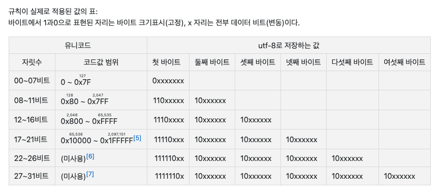

<!-- TOC -->

- [Question](#question)
- [0과 1로 숫자를 표현하는 방법](#0%EA%B3%BC-1%EB%A1%9C-%EC%88%AB%EC%9E%90%EB%A5%BC-%ED%91%9C%ED%98%84%ED%95%98%EB%8A%94-%EB%B0%A9%EB%B2%95)
    - [비트](#%EB%B9%84%ED%8A%B8)
    - [이진법](#%EC%9D%B4%EC%A7%84%EB%B2%95)
    - [이진수를 십진수로 변환할 때 이진수의 자리를 올림한다는 게 1과 0을 그냥 반대로 바꾼다는 뜻인가?](#%EC%9D%B4%EC%A7%84%EC%88%98%EB%A5%BC-%EC%8B%AD%EC%A7%84%EC%88%98%EB%A1%9C-%EB%B3%80%ED%99%98%ED%95%A0-%EB%95%8C-%EC%9D%B4%EC%A7%84%EC%88%98%EC%9D%98-%EC%9E%90%EB%A6%AC%EB%A5%BC-%EC%98%AC%EB%A6%BC%ED%95%9C%EB%8B%A4%EB%8A%94-%EA%B2%8C-1%EA%B3%BC-0%EC%9D%84-%EA%B7%B8%EB%83%A5-%EB%B0%98%EB%8C%80%EB%A1%9C-%EB%B0%94%EA%BE%BC%EB%8B%A4%EB%8A%94-%EB%9C%BB%EC%9D%B8%EA%B0%80)
    - [일상에서 사용하는 십진수가 있는데 십육진법이 왜 필요하지?](#%EC%9D%BC%EC%83%81%EC%97%90%EC%84%9C-%EC%82%AC%EC%9A%A9%ED%95%98%EB%8A%94-%EC%8B%AD%EC%A7%84%EC%88%98%EA%B0%80-%EC%9E%88%EB%8A%94%EB%8D%B0-%EC%8B%AD%EC%9C%A1%EC%A7%84%EB%B2%95%EC%9D%B4-%EC%99%9C-%ED%95%84%EC%9A%94%ED%95%98%EC%A7%80)
        - [십육진법](#%EC%8B%AD%EC%9C%A1%EC%A7%84%EB%B2%95)
        - [이진수 ↔ 십육진수 변환하기](#%EC%9D%B4%EC%A7%84%EC%88%98-%E2%86%94-%EC%8B%AD%EC%9C%A1%EC%A7%84%EC%88%98-%EB%B3%80%ED%99%98%ED%95%98%EA%B8%B0)
    - [컴퓨터는 어떤 방법을 이용해서 사람이 이해할 수 있는 숫자를 표현해주고 있는 걸까?](#%EC%BB%B4%ED%93%A8%ED%84%B0%EB%8A%94-%EC%96%B4%EB%96%A4-%EB%B0%A9%EB%B2%95%EC%9D%84-%EC%9D%B4%EC%9A%A9%ED%95%B4%EC%84%9C-%EC%82%AC%EB%9E%8C%EC%9D%B4-%EC%9D%B4%ED%95%B4%ED%95%A0-%EC%88%98-%EC%9E%88%EB%8A%94-%EC%88%AB%EC%9E%90%EB%A5%BC-%ED%91%9C%ED%98%84%ED%95%B4%EC%A3%BC%EA%B3%A0-%EC%9E%88%EB%8A%94-%EA%B1%B8%EA%B9%8C)
- [0과 1로 문자를 표현하는 방법](#0%EA%B3%BC-1%EB%A1%9C-%EB%AC%B8%EC%9E%90%EB%A5%BC-%ED%91%9C%ED%98%84%ED%95%98%EB%8A%94-%EB%B0%A9%EB%B2%95)
    - [인코딩, 디코딩 중 컴퓨터의 언어를 사람이 이해할 수 있는 언어로 변환하는 것은 어떤 걸까?](#%EC%9D%B8%EC%BD%94%EB%94%A9-%EB%94%94%EC%BD%94%EB%94%A9-%EC%A4%91-%EC%BB%B4%ED%93%A8%ED%84%B0%EC%9D%98-%EC%96%B8%EC%96%B4%EB%A5%BC-%EC%82%AC%EB%9E%8C%EC%9D%B4-%EC%9D%B4%ED%95%B4%ED%95%A0-%EC%88%98-%EC%9E%88%EB%8A%94-%EC%96%B8%EC%96%B4%EB%A1%9C-%EB%B3%80%ED%99%98%ED%95%98%EB%8A%94-%EA%B2%83%EC%9D%80-%EC%96%B4%EB%96%A4-%EA%B1%B8%EA%B9%8C)
        - [문자 집합character set](#%EB%AC%B8%EC%9E%90-%EC%A7%91%ED%95%A9character-set)
        - [인코딩](#%EC%9D%B8%EC%BD%94%EB%94%A9)
        - [디코딩](#%EB%94%94%EC%BD%94%EB%94%A9)
    - [아스키 코드](#%EC%95%84%EC%8A%A4%ED%82%A4-%EC%BD%94%EB%93%9C)
        - [아스키 코드 단점](#%EC%95%84%EC%8A%A4%ED%82%A4-%EC%BD%94%EB%93%9C-%EB%8B%A8%EC%A0%90)
    - [EUC-KR](#euc-kr)
    - [유니코드와 UTF-8](#%EC%9C%A0%EB%8B%88%EC%BD%94%EB%93%9C%EC%99%80-utf-8)
        - [유니코드](#%EC%9C%A0%EB%8B%88%EC%BD%94%EB%93%9C)
        - [유니코드는 아스키 코드나 EUC-KR과 어떤 점이 다른가?](#%EC%9C%A0%EB%8B%88%EC%BD%94%EB%93%9C%EB%8A%94-%EC%95%84%EC%8A%A4%ED%82%A4-%EC%BD%94%EB%93%9C%EB%82%98-euc-kr%EA%B3%BC-%EC%96%B4%EB%96%A4-%EC%A0%90%EC%9D%B4-%EB%8B%A4%EB%A5%B8%EA%B0%80)
        - [UTF-8](#utf-8)
        - [‘한글’ 을 UTF-8로 인코딩한 값을 구하면?](#%ED%95%9C%EA%B8%80-%EC%9D%84-utf-8%EB%A1%9C-%EC%9D%B8%EC%BD%94%EB%94%A9%ED%95%9C-%EA%B0%92%EC%9D%84-%EA%B5%AC%ED%95%98%EB%A9%B4)
- [Reference](#reference)

<!-- /TOC -->
# Question
- 이진수를 십진수로 변환할 때 이진수의 자리를 올림한다는 게 1과 0을 그냥 반대로 바꾼다는 뜻인가?
- 이진수랑 십진수를 어떻게 서로 변환하는 걸까?
- 일상에서 사용하는 십진수가 있는데 십육진법이 왜 필요하지?
- 컴퓨터는 어떤 방법을 이용해서 사람이 이해할 수 있는 숫자를 표현해주고 있는 걸까?

- 인코딩, 디코딩 중 컴퓨터의 언어를 사람이 이해할 수 있는 언어로 변환하는 것은 어떤 걸까?
- 아스키코드, 유니코드, EUC-KR, UTF-8  개념을 확실하게 이해하고 넘어가자

---
# 1. 0과 1로 숫자를 표현하는 방법

## 비트

- 컴퓨터가 이해하는 가장 작은 정보 단위
- 0과 1을 나타냄 → 두가지 정보를 표현할 수 있다

## 이진법

- 수학에서 0과 1만으로 모든 숫자를 표현하는 방법을 이진법이라고 한다
- 이진법을 이용하면 1보다 큰 수도 0과 1만으로 표현할 수 있다. **숫자가 1을 넘어가는 시점에 자리 올림**을 하면 된다.
- 십진법이 숫자가 9를 넘어가는 시점에 자리 올림을 하듯이, 이진법은 숫자가 1을 넘어가는 시점에 자리 올림을 하여 0과 1 두 개의 숫자만으로 모든 수를 표현한다

## 이진수를 십진수로 변환할 때 이진수의 자리를 올림한다는 게 1과 0을 그냥 반대로 바꾼다는 뜻인가?

- 이진법이라는 게 **1을 넘어가는 시점에 자리 올림**을 하여 0과 1만으로 모든 수를 표현하는 방법 이라는 것을 알게되었다. 이제 이진수를 십진수로 변환해보면서 해당 질문에 대한 답을 찾아가보자.

    ```text
    십진수 - 1 2 3 4 5 6 7 8
    이진수 - 1 (1을 넘어가는 시점이니 자리 올림)
           10
           11 (자리 올림)
           100
           101 (자리 올림) 
           110
           111 (자리 올림)
           1000
           
    ```

- 1과 0을 단순히 바꾸는 것이 아니라 숫자가 1을 넘어가는 시점이 되면 그 때 1 → 0 으로 올림이 되는 것이다. 10에서 0은 숫자가 1이 넘어가는 것이 아니니 0 → 1로 바꿔줘서 11이 되고 11은 숫자가 1이 넘어가니 1 → 0, 1 → 0 으로 올림이 되어 100이 된다.

## 일상에서 사용하는 십진수가 있는데 십육진법이 왜 필요하지?

### 십육진법

- 이진법을 이용하면 0과 1만으로 모든 숫자를 표현할 수 있다. 하지만 0과 1만으로 모든 숫자를 표현하려니 숫자의 길이가 너무 길어진다는 단점이 생긴다. 그래서 이진법 이외에 십육진법도 자주 사용하고 있다.
- 십육진법은 수가 **15를 넘어가는 시점에 자리 올림**을 하는 숫자 표현 방식이다.

    ```text
    십진수  - 0 1 2 3 4 5 6 7 8 9 10 11 12 13 14 15 16 17 ...
    십육진수 - 0 1 2 3 4 5 6 7 8 9 A  B  C  D  E  F  10 11 ...
    ```

  - 15를 넘어가는 시점 F 에서 자리 올림을 한다.
- 십육진법을 사용하는 주된 이유 중 하나는 이진수를 십육진수로, 십육진수를 이진수로 변환하기가 쉽기 때문이다.

### 이진수 ↔ 십육진수 변환하기

- 십육진수를 이진수로 변환할 때는 십육진수의 글자 하나하나를 4비트의 이진수로 간주하고 각각의 숫자를 이진수로 변환한 다음에 합치자.
- 이진수를 십육진수로 변화할 때는 이진수 숫자를 네 개 단위로 끊고, 네 개의 숫자를 십육진수로 변환한 다음에 합치자.
- 1A2B(16) 를 이진수로 변환하면?
  - 1(2), A(2), 2(2), B(2) 로 끊고
  - 0001(2), 1010(2), 0010(2), 1011(2) 각각 이진수로 변환
  - 합치면 → 결과는 000110100010(2)
- 11010101(2) 를 십육진수로 변환하면?
  - 1101(2), 0101(2) 네 개 단위로 끊고
  - 십육진수로 변환하면 13 이니까 D(16), 5는 그대로 5(16)
  - 합치면 → 결과는 D5(16)

## 컴퓨터는 어떤 방법을 이용해서 사람이 이해할 수 있는 숫자를 표현해주고 있는 걸까?

- 컴퓨터는 0과 1밖에 모르기 때문에 컴퓨터에 숫자를 알려주려면 이진수로 알려주어야 한다.
- 변환 과정을 거쳐 이진법으로 컴퓨터와 소통하게 된다.
<br>
---

# 2. 0과 1로 문자를 표현하는 방법

## 인코딩, 디코딩 중 컴퓨터의 언어를 사람이 이해할 수 있는 언어로 변환하는 것은 어떤 걸까?

### 문자 집합(character set)

- 컴퓨터가 인식할 수 있는 문자들의 모음
- 컴퓨터는 문자 집합에 속해 있지 않은 문자는 이해할 수 없다

### 인코딩

- 문자 집합에 있는 문자들을 **컴퓨터가 이해할 수 있는** 0과 1로 변환하는 과정

### 디코딩

- 0과 1로 표현된 문자 코드를 **사람이 읽을 수 있는** 문자로 변환하는 과정

## 아스키 코드

- [아스키 코드표 바로가기](https://ko.wikipedia.org/wiki/ASCII)
- 영어 알파벳, 아라비아 숫자, 일부 특수 문자를 포함하는 문자 집합
- 하나의 아스키 문자를 나타내는 데 7비트를 사용하므로 7비트로 표현할 수 있는 정보는 2의 7승 즉 128개의 문자를 표현할 수 있다
- 아스키 문자들은 총 128개의 숫자 중 하나의 고유한 수에 일대일로 대응된다. **아스키 문자에 대응된 고유한 수**를 아스키 코드라고 한다.
- 아스키 코드를 이진수로 표현하여 아스키 문자를 0과 1로 표현한다.

### 아스키 코드 단점

- 한글을 표현할 수 없고 아스키 문자 집합 외의 문자나 특수문자도 표현할 수 없다.
- 아스키 문자들은 7비트로 표현하기에 128개보다 많은 문자를 표현할 수 없다.

## EUC-KR

- 영어권 외의 나라들은 자신들의 언어를 0과 1로 표현할 수 있는 문자 집합과 인코딩 방식이 필요했기 때문에 이런 이유로 한글 인코딩 방식이 등장하게 되는데 이것이 EUC-KR 이다
- 방식
  - 완성형 인코딩: 초성,중성,종성 조합의 한 글자에 고유한 코드를 부여하는 인코딩 방식
    - 가: 1, 나:2, 다:3 …
  - 조합형 인코딩: 초성, 중성, 종성에 해당하는 각각의 코드를 합해서 하나의 글자 코드를 만드는 인코딩 방식
    - ㄱ: 0010, ㅏ: 0011 … → 0010 0011
- EUC-KR은 한글을 **2바이트** 크기로 인코딩할 수 있는 **완성형 인코딩** 방식
- 아스키 코드보다 표현할 수 있는 문자는 많아졌지만 여전히 모든 한글 조합을 표현할 수는 없다

## 유니코드와 UTF-8

### 유니코드

- EUC-KR보다 훨씬 다양한 한글을 포함하며 대부분 나라의 문자, 특수문자, 화살표나 이모티콘까지도 코드로 표현할 수 있는 통일된 문자 집합
- 유니코드는 현대 문자를 표현할 때 가장 많이 사용되는 **표준 문자 집합**이다
- 유니코드 문자 집합에서는 아스키 코드나 EUC-KR과 같이 각 문자마다 고유한 값이 부여된다

### 유니코드는 아스키 코드나 EUC-KR과 어떤 점이 다른가?

- 아스키 코드나 EUC-KR은 글자에 부여된 값을 그대로 인코딩 값으로 삼았지만 유니코드는 글자에 부여된 값 자체를 인코딩된 값으로 삼지 않고 다양한 방법으로 인코딩한다.
- 인코딩 방법에는 UTF-8, UTF-16, UTF-32 등이 있다.
- EUC-KR에서 ‘가’ 글자의 경우는 b0a1(16)이라는 고유한 값이 부여되고 b0a1 값으로 인코딩된다. 반면에 유니코드에서 ‘한’ 에 부여된 값은 D55C(16) 이고 이 값으로 그대로 인코딩 하지 않고 위의 방법으로 인코딩 한다.

### UTF-8

- UTF는 Unicode Transformation Format 의 약어로 유니코드를 인코딩하는 방법이다.
- UTF-8은 통상 1바이트부터 4바이트까지의 인코딩 결과를 만들어 낸다.
- UTF-8로 인코딩한 결과가 몇 바이트가 될지는 유니코드 문자에 부여된 값의 범위에 따라 결정된다.



### ‘한글’ 을 UTF-8로 인코딩한 값을 구하면?

- ‘한에 부여된 값은 D55C(16), ‘글’에 부여된 값은 AE00(16)
  - ‘한’ D55C(16) → 1101 0101 0101 1100(2)
  - ‘글’ AE00(16) → 1010 1110 0000 0000(2)
- ‘한’ 과 ‘글’ 모두 0800(16) ~ FFFF(16) 사이에 있다.
  - 0000 1000 0000 0000(2) ~ 1111 1111 1111 1111(2)
- 한글을 UTF-8로 인코딩하면 3바이트로 표현될 것이라 예상할 수 있다.
- 1과 0으로 표현된 자리는 고정이고, x표가 있는 자리에 유니코드 문자에 부여된 고유값이 들어간다.
- ‘한’ D55C(16) → 1101 0101 0101 1100(2), ‘글’ AE00(16) → 1010 1110 0000 0000(2) 이진수를 1110xxxx 10xxxxxx 10xxxxxx 에 각각 넣어보자
- UTF-8 방식으로 인코딩한 결과는?
  - 한 → 11101101 10010101 10011100(2)
  - 글 → 11101010 10111000 10000000(2)

---

# Reference
><혼자 공부하는 컴퓨터 구조 + 운영체제>