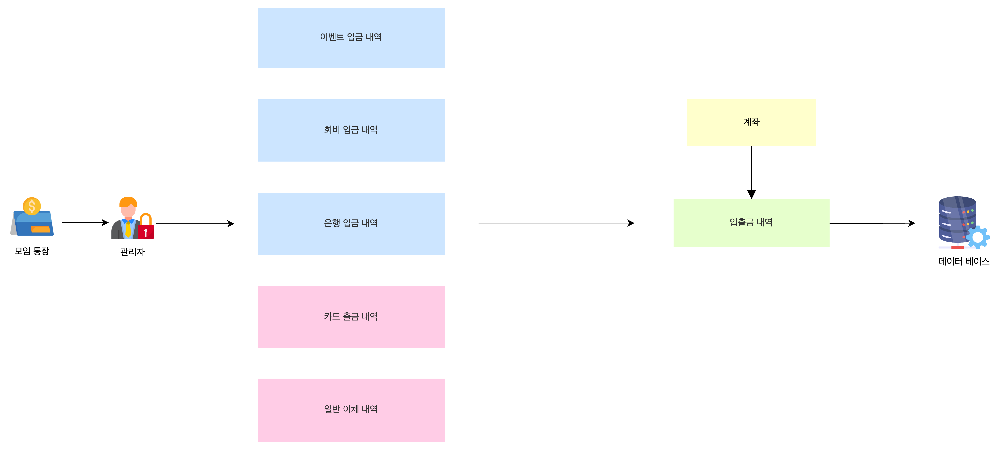

# 들어가며
## 샘플 소제목
### 카탈로그 테스트

안녕하세요! 이번 글은 API의 리소스명을 어떻게 지어야하는지에 대한 고민 과정에 대해서 공유하고자 합니다.

우선 제가 만들고 있는 서비스에 대해 간략하게 설명드릴게요. 저는 농구 동호회의 어드민 페이지를 만들고 있고 해당 서비스에서 필요한 기능은 크게 두 가지 입니다.

- 재무 관리
- 회원 관리

재무 관리 기능은 동호회 모임 통장과 관련한 기능인데요. 가계부 어플을 생각하면 이해하기 쉬울 거예요. 동호회 운영과 관련한 모든 재정적인 활동 내역을 기록하고 조회할 수 있는 기능입니다. 이 글에서는 재무 관리 기능에 대해서만 다룰 거예요.

대쉬보드에 이달의 입금 & 지출 내역 Top3 를 보여주고 싶습니다. 해당 API 엔드포인트를 설계하려고 해요. 그런데 리소스 이름을 어떻게 지어야 할까요?

# 도메인명으로 작성하면 되지 않나?

입출금 내역으로 AccountTransaction 이라는 도메인을 사용하고 있어요. 그렇다면 이달의 입금 내역과 지출 내역을 조회하는 API를 설계할 때 `/account-transactions` 라는 리소스명을 사용하면 되지 않을까요? 아래와 같이 말이죠.

### 1. 이달의 입금 내역 상위 3개를 조회하는 API

HTTP Method: GET

Endpoint: `/account-transactions/deposits/top3`

Query Parameters:

- `year`: 조회할 연도 (예: 2024)
- `month`: 조회할 월 (예: 7)

### 2. 이달의 지출 내역 상위 3개를 조회하는 API

HTTP Method: GET

Endpoint: `/account-transactions/expenses/top3`

Query Parameters:

- `year`: 조회할 연도 (예: 2024)
- `month`: 조회할 월 (예: 7)

# 도메인의 관계가 이렇다면?

모임 통장에서 발생하고 있는 내역을 분류하면 위의 그림과 같아요. 입금 내역 A,B,C와 출금 내역 D,E 라고 설명하겠습니다. 입금 내역 A가 저장이 되면 입출금 내역에 A의 고유 ID와 트랜잭션 타입이 저장됩니다. 입금 내역 A를 조회하고 싶다면 A 테이블을 조회해서 데이터를 가져옵니다.

입출금 내역 테이블에 A의 데이터가 저장되어 있는 게 아니라 테이블의 속성으로 고유 ID와 트랜잭션 타입이 저장되어 있는데 이런 상황에도 `/account-transactions` 라는 리소스명을 사용해도 되는지 혼란이 왔습니다.

# API 사용자의 입장에서 생각해볼까?

관점을 바꿔서 생각해봅시다. API 엔드포인트의 네이밍은 특정 도메인 객체가 직접적으로 데이터를 포함하고 있는지 여부보다는 리소스의 의미와 API 사용자에게 전달하는 메시지가 중요해요.

`/account-transactions` 를 사용하는 API 사용자의 입장에서 해당 엔드포인트는 어떨까요?

- 계좌의 거래내역과 관련한 정보를 요청하고 있다
- 계좌 거래내역이 입금 및 출금과 관련한 메타데이터를 관리하고 있다
- 계좌 거래 내역의 입금 및 출금 데이터 중 상위 3개의 데이터를 반환한다
- 2024년, 7월을 파라미터로 전달한다면 2024년 7월 입금 및 출금 데이터 중에서 상위 3개의 데이터를 확인할 수 있다

원하는 결과값을 어느 테이블에서 들고 오느냐는 API 사용자의 관심사가 아닙니다. API 사용자가 원하는 결과값을 어떤 방식으로 구현하느냐는 API 제공자의 역할이에요. API 사용자는 결과값을 요청하는 것이 주된 관심사입니다.  따라서 API를 설계할 때는 API 사용자에게 직관적이고 명확한 경험을 제공해주는 것이 중요합니다.

# 마무리하며

API를 만들 때 했던 고민을 글로 정리해 보니 음… 별거 아니게 느껴지네요. 간단하게 결론이 지어졌어요.
사용자의 입장으로 돌아가자!
서비스의 요구사항들이 `입출금 내역`으로부터 파생되기 때문에 설계를 할 때도 너무 입출금 내역에만 중점을 뒀던 것 같아요. AccountTransaction 도메인은 처음엔 AccountBook 이었다가 AccountLog 가 되기도 했고 필요한 속성들도 수시로 바뀌었습니다. 도메인도 AccountTransaction(입출금 내역), Deposit(입금 내역), Withdrawal(출금 내역) 로 정했다가 계속해서 변경되었어요.

서비스의 요구사항과 목적을 제대로 정립하지 않아서 하나의 도메인이 여러 책임을 담당하게 되고 때문에 도메인의 변경이 잦아졌습니다. 그에따라 API 엔드포인트도 변경을 해야만 했어요. 서비스의 요구사항을 제대로 정립하기 위해선 도메인 탐구가 선행되어야겠다는 판단을 하게 됐습니다.

다음에는 도메인을 탐구하는 과정에서 생긴 일들을 공유하게 되면 좋겠습니다!