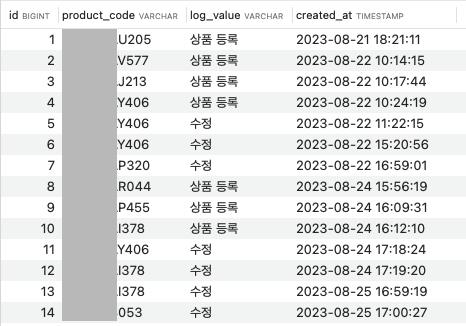
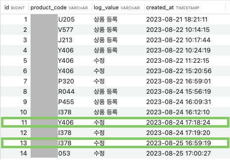
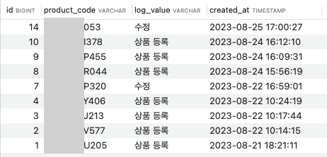
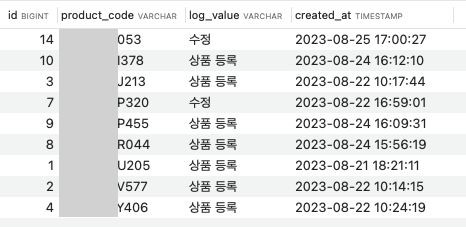
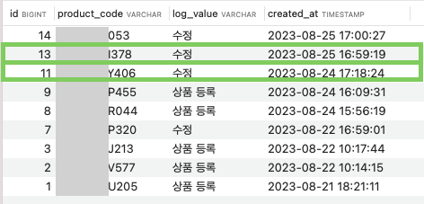

# 단순 쿼리 해결 방법을 글로 남기는 이유

group by 내부 정렬하는 방법을 구글링 한 게 이번이 처음이 아니기 때문입니다. 몇달 전에도 같은 문제로 구글링을 했고 동일한 해결 과정을 거쳤었어요. 구글링하면서 “아, 맞다! 맞다. 맞다. 아 이거 안되지 참….” 을 반복하면서 이건 정리를 하면서 공부해 놓고 넘어가야 다음에 또 반복 안하겠다는 생각이 들었습니다. 그동안 빨리 쿼리 짜서 원하는 데이터가 결과로 나오는 걸 확인하고 다음 스텝으로 넘어 갔었는데 시간 없다는 핑계로 계속 다음 다음만 했다가는 계속 이런 식으로만 개발할 것 같아서 잘 모르고 넘어갔던 빈틈을 채워보려고 합니다.

# 하고 싶은 것

배치 로직을 개발해야 하는데 이에 필요한 데이터를 쿼리문으로 들고 와야해요. 필요한 데이터는 **‘보험 아이디 별 최신 데이터 한 건’** 입니다. 회사 데이터를 가져올 수가 없어서 제가 하고 싶은 쿼리를 뽑아낼 수 있는 샘플 데이터를 가지고 왔어요. 해당 케이스에서의 미션은 아래와 같습니다.

**⭐️ 미션: product_code(상품코드)별 제일 최근에 등록된 데이터 가져오기**



# 원하는 결과



샘플 데이터가 조금 고르지 못한데요. 미션을 성공하려면 id 가 1, 2, 3, 11, 7, 8, 9, 13, 14 번 데이터가 나와야해요. 나머지 데이터는 뒤로하고, 여기서 주의 깊게 봐야할 데이터는 product_code 가 406인 데이터와 378인 데이터입니다.

상품코드 406번의 로그를 보면 ‘상품 등록 → 수정 → 수정 → 수정’ 으로 제일 최근 데이터는 id 가 11번인 데이터 입니다. 상품코드 378번은 id가 13번인 데이터가 나와야 하구요.

# 왜… 왜 이렇게 나오는데…

product_code 별로 created_at 을 최신순 정렬을 한 다음에 해당 데이터 row만 뽑으면 내가 원하는 결과를 가져올 수 있겠다 생각하고 쿼리를 짭니다. 쿼리는 아래와 같습니다.

```sql
SELECT id, product_code, log_value, created_at 
FROM product_sale_log
GROUP BY product_code
ORDER BY created_at DESC;
```



쿼리의 결과를 살펴볼까요? created_at 을 보면 데이터가 최신순으로 정렬되어 있는 것처럼 보이지만 제가 의도한 결과는 아닙니다. 전체 데이터를 최신순으로 정렬하는 게 아니라 일단 데이터를 product_code 별로 묶고, product_code 내에서 최신순으로 정렬한 결과 가장 최근의 데이터 행 하나를 원했던 것이었어요. GROUP BY는 된듯한데 GROUP BY 내에서 정렬은 일어나지 않은 것 같아요. 위의 결과는 product_code 별로 묶을 때 데이터베이스에 저장되어 있는대로 첫번째 row를 기준으로 묶어서 가져온 것이에요.

왜….? 왜 ORDER BY 는 싸그리 무시된 채 GROUP BY 만 적용이 된 걸까요…. query 가 실행되는 순서를 살펴봅시다. 해당 query 를 실행시키면 product_code 를 기준으로 GROUP BY 를 해요. 이 때 이미 각 product_code 별로 첫번째 행을 가져왔어요. 데이터 행에서 id, product_code, log_value, created_at 컬럼을 가져오고, 이렇게 구성된 데이터를 created_at 을 기준으로 ORDER BY 합니다. 그래서 데이터가 저렇게 나온 거죠. 작성한 쿼리대로 데이터는 잘 나왔어요.

```
💡 쿼리가 실행되는 순서: **GROUP BY** -> **ORDER BY**
```

# group by 내부 정렬하기

왜 결과가 의도한 대로 나오지 않았는지 알았으니, 이제 원하는 결과를 뽑을 수 있는 쿼리를 짜보도록 합시다. 미션을 다시 떠올려보아요. **‘product_code(상품코드)별 제일 최근에 등록된 데이터 가져오기’**

group by → order by 순으로 실행이 되니까 그럼… group by 하기 전에 created_at 컬럼을 최신순으로 order by를 해놓고 이렇게 정렬된 데이터를 대상으로 product_code 로 group by를 하면 원하는 결과가 나오지 않을까요? 쿼리문으로 한번 옮겨볼게요.

```sql
SELECT id, product_code, log_value, created_at 
FROM (select * from product_sale_log order by created_at desc) as sub
GROUP BY product_code;
```



378번 상품코드와 406번 상품코드의 로그는 ‘**상품 등록‘** 이에요. 네… 잘못되었습니다. 원하는 결과가 아니에요. FROM 절의 **(select * from product_sale_log order by created_at desc)** 해당 쿼리를 따로 뜯어서 실행시킨 것과 서브 쿼리 내에서 실행결과가 달라요. MySQL은 ORDER BY 가 서브쿼리 안에 있을 때 성능 이슈 문제 때문에 ORDER BY가 무시된다고 합니다.

# Rank() 와 Partition By() 사용하기

반드시 GROUP BY 를 써서 해결을 해야할 필요가 없었기 때문에 다른 방법을 사용해서 해결하려고 합니다. 순위를 매기는 rank() 함수를 이용해서 product_code 별로 최신순으로 랭킹을 세우고, 랭킹이 1번인 데이터 행을 가져오게 하면 의도한 결과를 낼 수 있을 것 같아요.

해당 쿼리는 아래와 같습니다.

```sql
SELECT id, product_code, log_value, created_at
FROM (
        select id, product_code, log_value, created_at,
               rank() over (partition by product_code order by created_at desc ) rank
        from product_sale_log
     ) test
where
    rank = 1
order by created_at desc;
```



상품코드 378번과 406번의 데이터를 보면 드디어 의도한 결과가 나온 것을 확인할 수 있습니다. select 에 rank 데이터도 확인해보면 랭킹이 1인 데이터를 가져온 것을 확인해볼 수가 있어요.

# 공부해봐야할 점

1. Order By 가 서브쿼리에 존재할 때 어떤 성능 이슈가 있는지
2. w3schools 에서 OrderDetails 테이블을 대상으로 쿼리 테스트를 했을 때는 서브쿼리에 order by 를 적용해서 만든 아래의 쿼리가 잘 적용이 되었어요. 왜 된 건지 그리고 지금 사용하고 있는 db 툴에서는 왜 안되는 건지. 어떨 때 되고 안되는지를 더 알아봐야 될 것 같습니다.